## 双系统（Windows 11 & Ubuntu）安装指南

### 一、准备工作

#### 设备需求
- **两台电脑**：
  - 一台查看安装指南
  - 一台用于安装双系统（需具备两个磁盘）
- **三个U盘**：
  - Windows系统盘（至少8GB）
  - Ubuntu系统盘（至少8GB）
  - 文件备份盘

#### 文件备份
- 拷贝电脑内所有重要文件到备份U盘。
- 删除或卸载不必要的软件和文件，确认全部转移后，格式化磁盘至恢复出厂设置（也不是必要的，之后的安装过程有格式化的步骤）。

---

### 二、制作启动U盘

#### Windows 11启动U盘
- 下载[Windows 11 ISO镜像](https://www.microsoft.com/en-us/software-download/windows11)。
- 下载并安装[Rufus](https://rufus.ie/zh/)。
- 插入Windows系统U盘，确保已格式化且无其他文件。
- 使用Rufus写入ISO镜像，等待提示“准备就绪”即完成。
- 参考配置：
设备：选中U盘  
引导类型选择：点击“选择”，找到本地笔记本存储的iso镜像文件  
分区类型：选择“MBR”（说明：新的主板，通常支持 GPT分区和UEFI引导，选择“GPT”；较旧的主板，选择“MBR”）  
卷标：启动盘名称  
其他：默认配置，无需操作
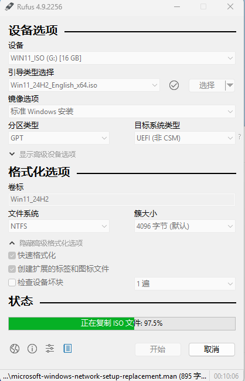
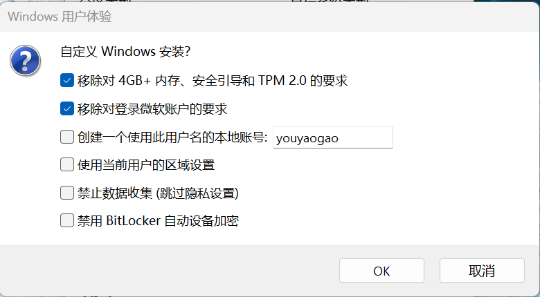
- 等待制作完成  
过程大约等待3-10分钟，完成后状态跳转为“准备就绪”；
点击“关闭”。


#### Ubuntu启动U盘
- 下载[Ubuntu ISO镜像](https://ubuntu.com/download)。
- 使用Rufus制作启动盘，ISO复制完成后即可。
- 按照如下截图操作即可。
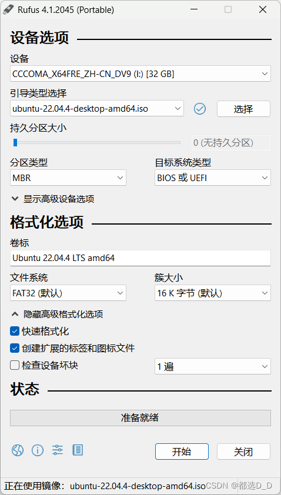
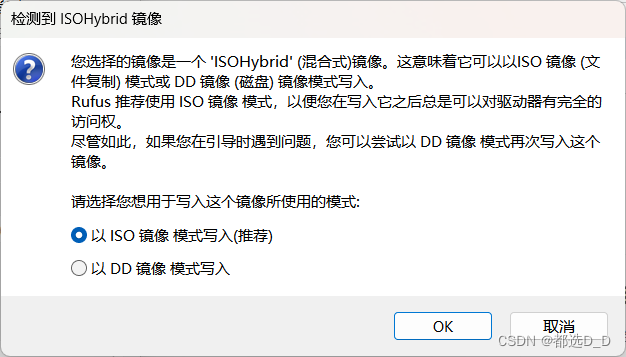
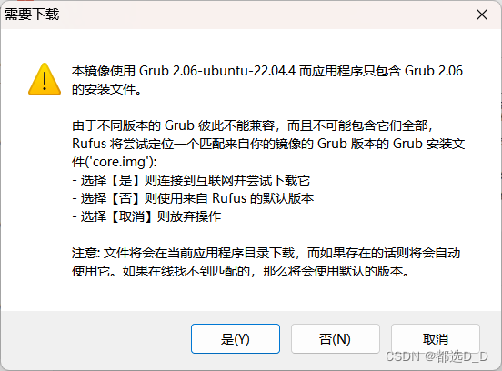
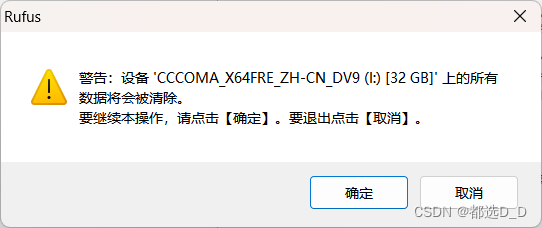
---

### 三、安装Windows 11

#### BIOS设置
- 插入Windows U盘，开机时按F12、F9或ESC进入BIOS（依据品牌而定）。
- 关闭安全启动（Secure Boot），启动顺序设置为U盘优先，保存并重启。

#### 系统安装
- 根据提示选择语言、地区和键盘布局。
- 推荐普通用户安装Windows 11 Home，专业用户选择Pro。
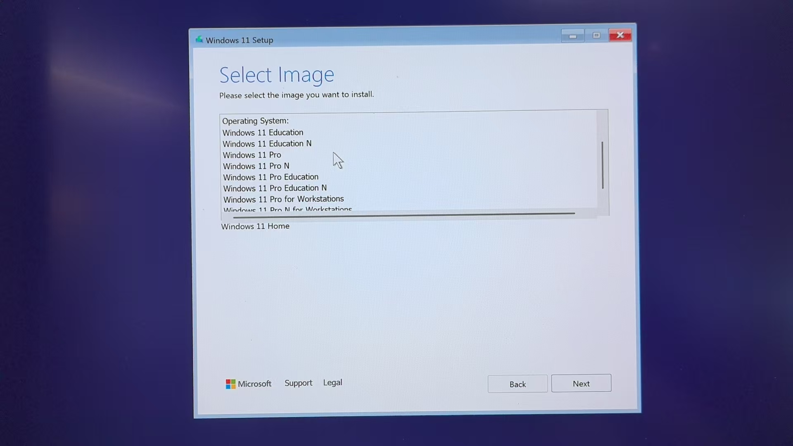
- 产品密钥暂不输入。
- 选择磁盘，将所有的磁盘分区删除为“未分配空间”，点击下一步安装。
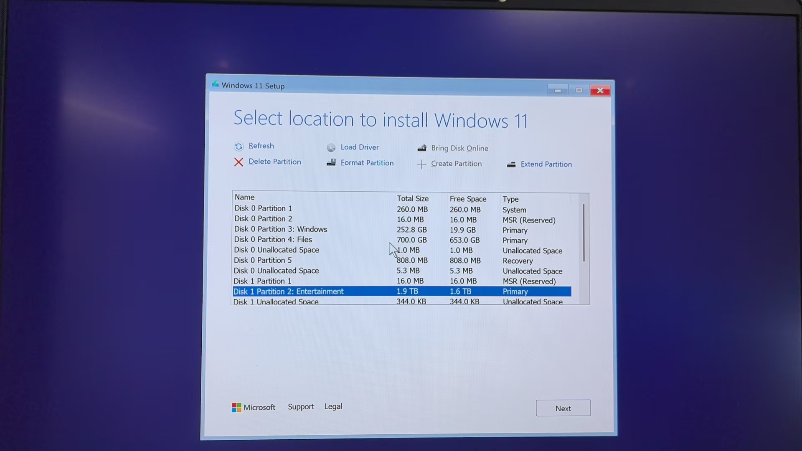
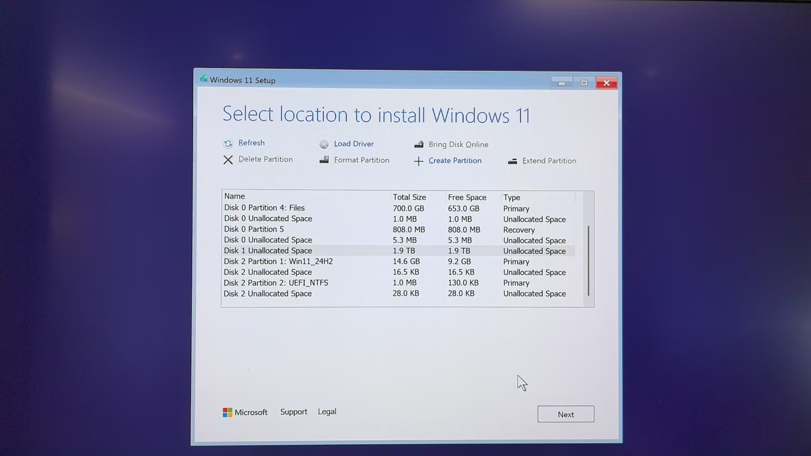
- 安装完成后拔掉U盘，重启进入新安装的Windows 11。
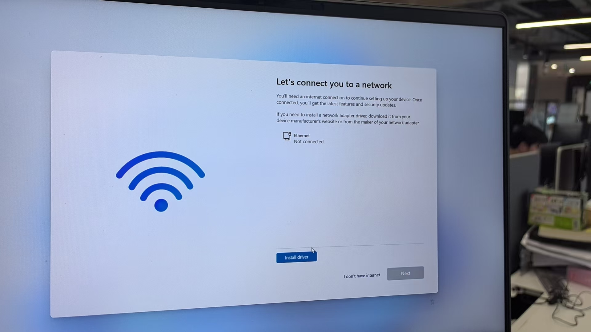

---

### 四、安装Ubuntu

#### 启动安装
- 插入Ubuntu U盘，重启进入Ubuntu安装界面。
  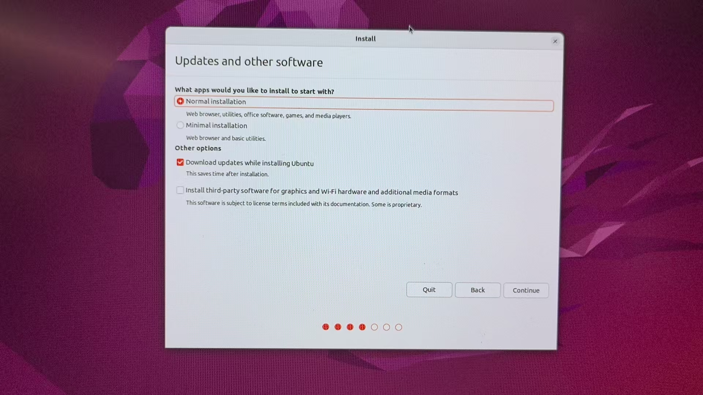
  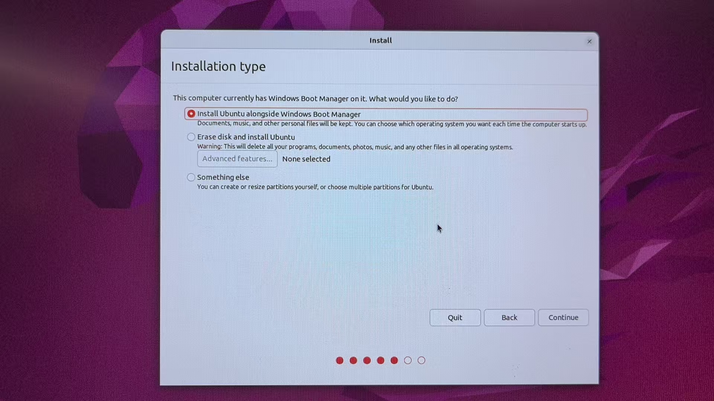
#### 磁盘分区方案
- 删除磁盘全部分区为Free Space。
- 推荐分区结构：
  - EFI分区：512MB，EFI
  - Swap分区：Logical, 物理内存两倍大小，Swap Area
  - 根分区(`/`)：至少100GB，Ext4
  - 用户目录(`/home`)：剩余全部空间，Ext4

#### 分区具体步骤
- 在安装界面依次新建上述分区。
  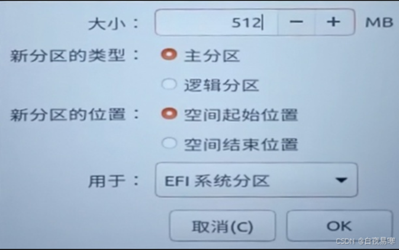
  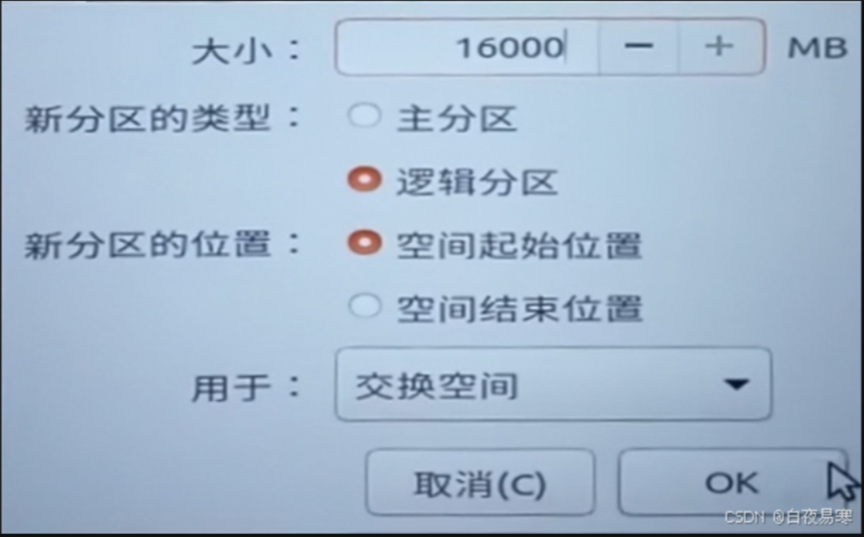
  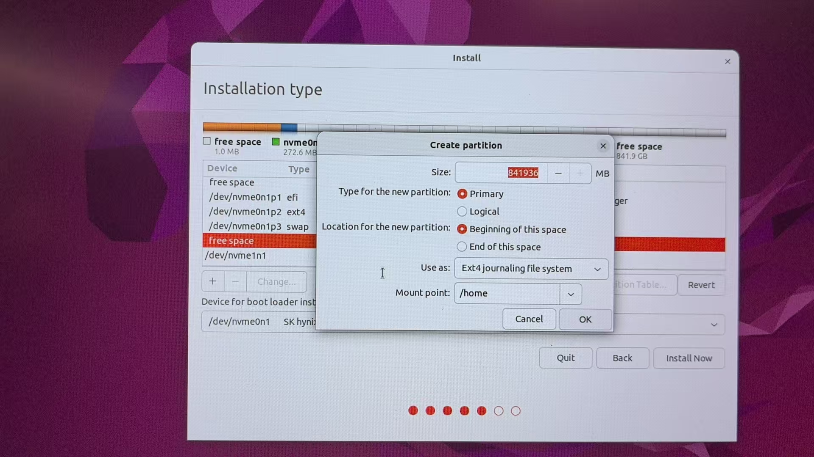  
  
- 完成分区后，选择EFI引导区，点击安装。
- 输入用户名和密码完成安装。
  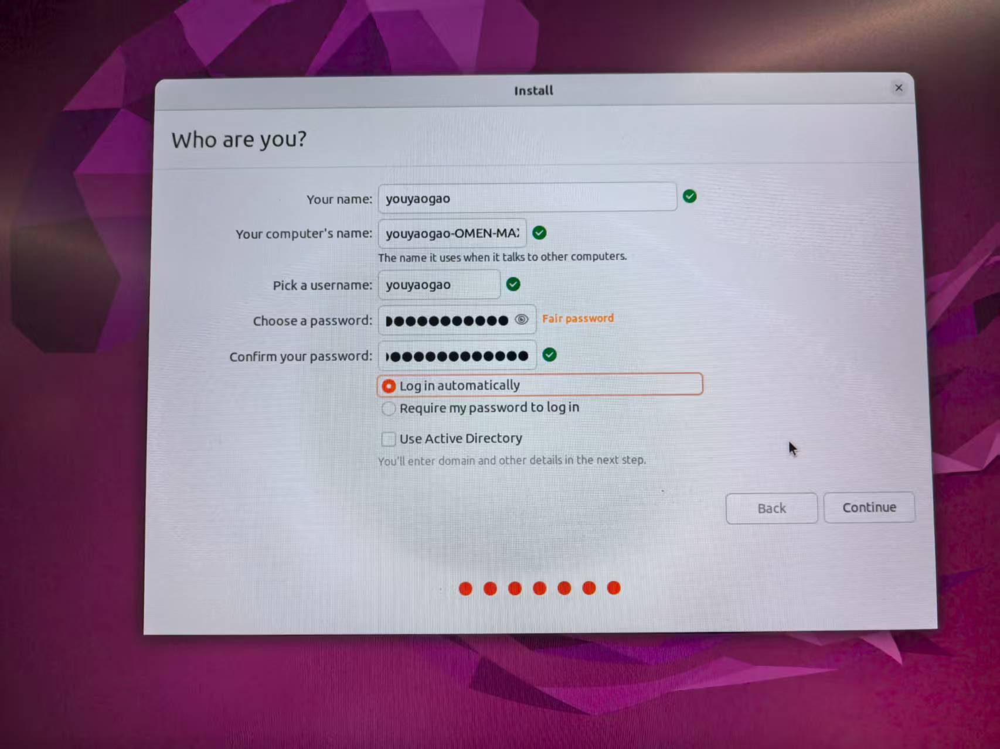
---

### 五、配置启动菜单（GRUB）
- Ubuntu中打开终端输入：
  ```bash
  sudo nano /etc/default/grub
- 找到以下内容并修改：
  ```bash
  GRUB_TIMEOUT=10  # 等待用户选择系统，10秒后进入默认
  GRUB_DEFAULT=2   # 设置默认启动为Windows（一般为第3个选项）
- 保存修改并退出编辑器：按 Ctrl+O 后回车保存 按 Ctrl+X 退出
- 更新GRUB设置：
  ```bash
  sudo update-grub
- 重启之后会出现GRUB菜单
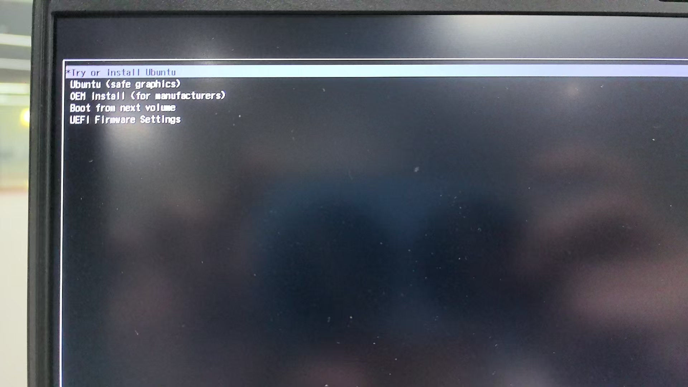
---

### 六、Windows驱动安装

#### 驱动安装顺序
- 优先安装网络驱动程序。
- 网络连接成功后，进入电脑品牌官方网站，自动检测并安装其他所需驱动程序。

#### 驱动状态检查
- 进入**设备管理器**，检查是否存在带黄色感叹号标记的设备。
- 若发现未正常安装的驱动，可通过Windows Update自动修复，或前往电脑品牌官网手动下载对应驱动程序安装。
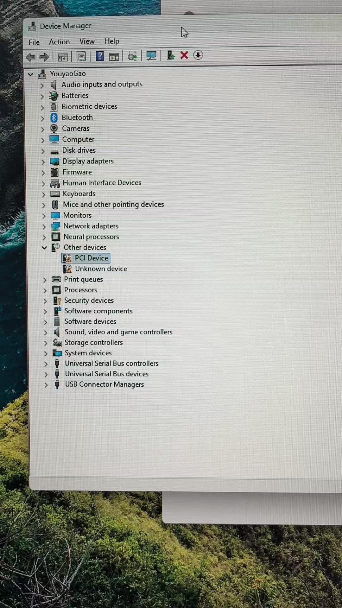
---

### 七、优化Windows磁盘空间及桌面设置

#### 推荐磁盘布局
- 建议系统盘（C盘）空间不少于250GB。

#### 桌面文件夹迁移步骤
1. 打开资源管理器，路径：`C:\Users\你的用户名\Desktop`。
2. 右键点击“桌面”文件夹，选择**属性**。
3. 在**位置**选项卡中，点击**移动**，选择另一个磁盘的文件夹。
4. 点击**应用**确认，系统询问是否移动原有文件时选择**是**。

---

### 八、安装常用软件及激活产品

#### 软件安装建议
- 推荐安装以下软件：
  - 搜狗输入法（中文输入法）
  - 微信（中国社交平台）
  - Chorme Browser
  - Microsoft Office 办公套件（可通过Microsoft商店或官网下载安装）

#### 软件激活说明
- Microsoft Office 可通过微软账号登录安装，若需激活密钥，请前往正规渠道（例如淘宝或微软官方商城）购买正版产品。

---

