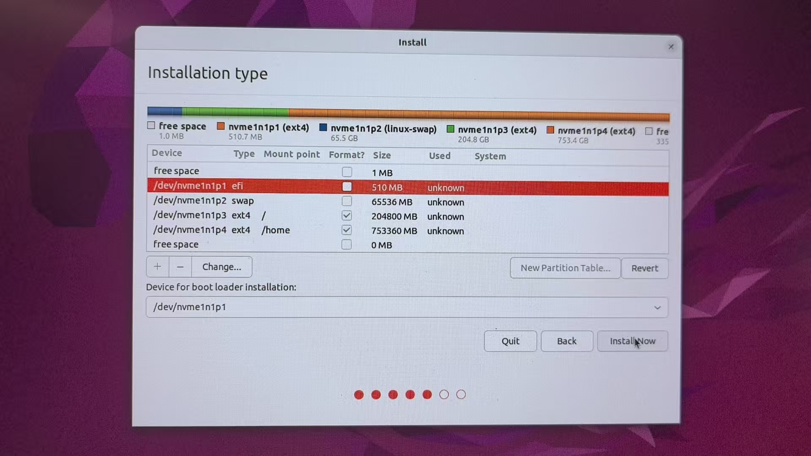

# Dual-System Installation Handbook

[English](#english-version) | [中文](#中文说明)

---

# <a name="english-version"></a>English Version

## Dual System (Windows 11 & Ubuntu) Installation Guide

### I. Preparation

#### Hardware Requirements
- **Two Computers**:
  - One for viewing the installation guide
  - One for installing the dual system (must have two disks)
- **Three USB Drives**:
  - Windows system USB (at least 8GB)
  - Ubuntu system USB (at least 8GB)
  - File backup USB

#### File Backup
- Copy all important files from the computer to the backup USB.
- Delete or uninstall unnecessary software and files. After confirming all files are transferred, format the disk to factory settings (this is optional, as the installation process includes formatting steps).

---

### II. Creating Bootable USB Drives

#### Windows 11 Bootable USB
- Download the [Windows 11 ISO image](https://www.microsoft.com/en-us/software-download/windows11).
- Download and install [Rufus](https://rufus.ie/en/).
- Insert the Windows system USB, ensuring it is formatted and contains no other files.
- Use Rufus to write the ISO image, and wait for the "Ready" prompt to indicate completion.
- Reference configuration:
  Device: Select the USB drive  
  Boot selection: Click "Select" to locate the ISO image file stored on the local computer  
  Partition scheme: Select "MBR" (Note: For newer motherboards, typically supporting GPT partition and UEFI boot, select "GPT"; for older motherboards, select "MBR")  
  Volume label: Name of the bootable USB  
  Others: Default settings, no changes needed  
    
    
- Wait for the process to complete  
  The process takes approximately 3-10 minutes. Once completed, the status will change to "Ready";  
  Click "Close".

#### Ubuntu Bootable USB
- Download the [Ubuntu ISO image](https://ubuntu.com/download).
- Use Rufus to create the bootable USB. The process is complete once the ISO is written.
- Follow the steps shown in the screenshots below:  
    
    
    
    

---

### III. Installing Windows 11

#### BIOS Settings
- Insert the Windows USB and press F12, F9, or ESC (depending on the brand) during startup to enter BIOS.
- Disable Secure Boot, set the boot order to prioritize the USB, save, and restart.

#### System Installation
- Follow the prompts to select language, region, and keyboard layout.
- For general users, install Windows 11 Home; for professional users, choose Pro.  
    
- Skip entering the product key for now.
- Select the disk, delete all partitions to create "Unallocated Space," and click Next to install.  
    
    
- After installation, remove the USB and restart to enter the newly installed Windows 11.  
    

---

### IV. Installing Ubuntu

#### Start Installation
- Insert the Ubuntu USB and restart to enter the Ubuntu installation interface.  
    
    

#### Disk Partitioning Scheme
- Delete all disk partitions to create Free Space.
- Recommended partition structure:
  - EFI partition: 512MB, EFI
  - Swap partition: Logical, twice the size of physical memory, Swap Area
  - Root partition (/): At least 100GB, Ext4
  - Home partition (/home): Remaining space, Ext4

#### Partitioning Steps
- Create the above partitions in sequence on the installation interface.  
    
    
    
    
- After partitioning, select the EFI boot partition and click Install.
- Enter username and password to complete the installation.  
    

---

### V. Configuring the Boot Menu (GRUB)
- Open a terminal in Ubuntu and enter:

```bash
sudo nano /etc/default/grub
```
- Locate and modify the following lines:

```bash
GRUB_TIMEOUT=10  # Wait time for user to select system, defaults to 10 seconds
GRUB_DEFAULT=2   # Set default boot to Windows (usually the 3rd option)
```
- Save changes and exit the editor: Press Ctrl+O, then Enter to save, and Ctrl+X to exit.
- Update GRUB settings:

```bash
sudo update-grub
```
- Restart to see the GRUB menu.  
    

---

### VI. Installing Windows Drivers

#### Driver Installation Order
- Prioritize installing the network driver.
- Once the network is connected, visit the computer manufacturer's official website to automatically detect and install other required drivers.

#### Driver Status Check
- Open **Device Manager** and check for devices marked with a yellow exclamation point.
- If any drivers are not installed correctly, use Windows Update for automatic fixes or manually download the appropriate drivers from the computer manufacturer's website.  
    

---

### VII. Optimizing Windows Disk Space and Desktop Settings

#### Recommended Disk Layout
- Ensure the system disk (C drive) has at least 250GB of space.

#### Desktop Folder Migration Steps
1. Open File Explorer and navigate to: `C:\Users\YourUsername\Desktop`.
2. Right-click the "Desktop" folder and select **Properties**.
3. In the **Location** tab, click **Move** and select a folder on another disk.
4. Click **Apply** to confirm. When prompted to move existing files, select **Yes**.

---

### VIII. Installing Common Software and Activating Products

#### Software Installation Recommendations
- Recommended software:
  - Sogou Input Method (Chinese input method)
  - WeChat (Chinese social platform)
  - Chrome Browser
  - Microsoft Office Suite (download and install via Microsoft Store or official website)

#### Software Activation Notes
- Microsoft Office can be installed by logging into a Microsoft account. To activate, purchase a legitimate product key from authorized channels (e.g., Taobao or Microsoft’s official store).

---
# 中文说明

## 双系统（Windows 11 & Ubuntu）安装指南

### 一、准备工作

#### 设备需求
- **两台电脑**：
  - 一台查看安装指南
  - 一台用于安装双系统（需具备两个磁盘）
- **三个U盘**：
  - Windows系统盘（至少8GB）
  - Ubuntu系统盘（至少8GB）
  - 文件备份盘

#### 文件备份
- 拷贝电脑内所有重要文件到备份U盘。
- 删除或卸载不必要的软件和文件，确认全部转移后，格式化磁盘至恢复出厂设置（也不是必要的，之后的安装过程有格式化的步骤）。

---

### 二、制作启动U盘

#### Windows 11启动U盘
- 下载[Windows 11 ISO镜像](https://www.microsoft.com/en-us/software-download/windows11)。
- 下载并安装[Rufus](https://rufus.ie/zh/)。
- 插入Windows系统U盘，确保已格式化且无其他文件。
- 使用Rufus写入ISO镜像，等待提示“准备就绪”即完成。
- 参考配置：
设备：选中U盘  
引导类型选择：点击“选择”，找到本地笔记本存储的iso镜像文件  
分区类型：选择“MBR”（说明：新的主板，通常支持 GPT分区和UEFI引导，选择“GPT”；较旧的主板，选择“MBR”）  
卷标：启动盘名称  
其他：默认配置，无需操作


- 等待制作完成  
过程大约等待3-10分钟，完成后状态跳转为“准备就绪”；
点击“关闭”。


#### Ubuntu启动U盘
- 下载[Ubuntu ISO镜像](https://ubuntu.com/download)。
- 使用Rufus制作启动盘，ISO复制完成后即可。
- 按照如下截图操作即可。


---

### 三、安装Windows 11

#### BIOS设置
- 插入Windows U盘，开机时按F12、F9或ESC进入BIOS（依据品牌而定）。
- 关闭安全启动（Secure Boot），启动顺序设置为U盘优先，保存并重启。

#### 系统安装
- 根据提示选择语言、地区和键盘布局。
- 推荐普通用户安装Windows 11 Home，专业用户选择Pro。

- 产品密钥暂不输入。
- 选择磁盘，将所有的磁盘分区删除为“未分配空间”，点击下一步安装。


- 安装完成后拔掉U盘，重启进入新安装的Windows 11。


---

### 四、安装Ubuntu

#### 启动安装
- 插入Ubuntu U盘，重启进入Ubuntu安装界面。
  
  
#### 磁盘分区方案
- 删除磁盘全部分区为Free Space。
- 推荐分区结构：
  - EFI分区：512MB，EFI
  - Swap分区：Logical, 物理内存两倍大小，Swap Area
  - 根分区(`/`)：至少100GB，Ext4
  - 用户目录(`/home`)：剩余全部空间，Ext4

#### 分区具体步骤
- 在安装界面依次新建上述分区。
  
  
    
  
- 完成分区后，选择EFI引导区，点击安装。
- 输入用户名和密码完成安装。
  
---

### 五、配置启动菜单（GRUB）
- Ubuntu中打开终端输入：
  ```bash
  sudo nano /etc/default/grub
- 找到以下内容并修改：
  ```bash
  GRUB_TIMEOUT=10  # 等待用户选择系统，10秒后进入默认
  GRUB_DEFAULT=2   # 设置默认启动为Windows（一般为第3个选项）
- 保存修改并退出编辑器：按 Ctrl+O 后回车保存 按 Ctrl+X 退出
- 更新GRUB设置：
  ```bash
  sudo update-grub
- 重启之后会出现GRUB菜单

---

### 六、Windows驱动安装

#### 驱动安装顺序
- 优先安装网络驱动程序。
- 网络连接成功后，进入电脑品牌官方网站，自动检测并安装其他所需驱动程序。

#### 驱动状态检查
- 进入**设备管理器**，检查是否存在带黄色感叹号标记的设备。
- 若发现未正常安装的驱动，可通过Windows Update自动修复，或前往电脑品牌官网手动下载对应驱动程序安装。

---

### 七、优化Windows磁盘空间及桌面设置

#### 推荐磁盘布局
- 建议系统盘（C盘）空间不少于250GB。

#### 桌面文件夹迁移步骤
1. 打开资源管理器，路径：`C:\Users\你的用户名\Desktop`。
2. 右键点击“桌面”文件夹，选择**属性**。
3. 在**位置**选项卡中，点击**移动**，选择另一个磁盘的文件夹。
4. 点击**应用**确认，系统询问是否移动原有文件时选择**是**。

---

### 八、安装常用软件及激活产品

#### 软件安装建议
- 推荐安装以下软件：
  - 搜狗输入法（中文输入法）
  - 微信（中国社交平台）
  - Chorme Browser
  - Microsoft Office 办公套件（可通过Microsoft商店或官网下载安装）

#### 软件激活说明
- Microsoft Office 可通过微软账号登录安装，若需激活密钥，请前往正规渠道（例如淘宝或微软官方商城）购买正版产品。

---


